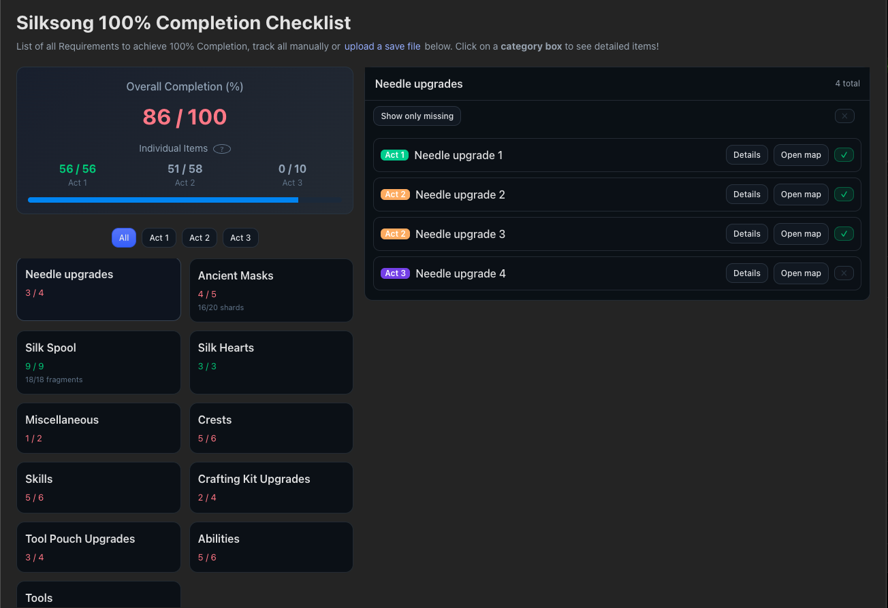

# 🕷️ Hollow Knight: Silksong - 100% Completion Tracker



A comprehensive completion tracker for **Hollow Knight: Silksong** that helps you achieve 100% completion by tracking all collectibles, upgrades, and requirements.

## ✨ Features

- **📋 Complete Checklist** - Track all 100+ items required for 100% completion
- **🎮 Manual Progress Tracking** - Click to mark items as obtained
- **💾 Auto-Save Progress** - Your progress is automatically saved to local storage
- **📱 Mobile Friendly** - Responsive design with mobile modal interface
- **🗺️ Interactive Map Links** - Direct links to interactive map locations for each item
- **📊 Progress Overview** - See completion percentage and progress by act
- **📁 Save File Support** - Upload your save file for automatic progress detection
- **🎯 Category Organization** - Items organized by type (Tools, Masks, Abilities, etc.)
- **🔍 Smart Filtering** - Filter by act or show only missing items
- **⚡ Bulk Actions** - Select/clear all items in a category at once

## 🎯 What's Tracked

### Core Categories
- **🔧 Tools** (51 items) - All tools and equipment
- **⚔️ Needle Upgrades** (4 upgrades) - Weapon improvements
- **🎭 Ancient Masks** (5 masks) - Health upgrades from mask shards
- **🧵 Silk Spool** (9 fragments) - Special ability upgrades
- **💖 Silk Hearts** (3 hearts) - Soul capacity upgrades
- **⚙️ Tool Pouch Upgrades** (4 expansions) - Inventory expansions
- **🛠️ Crafting Kit Upgrades** (4 expansions) - Crafting improvements
- **🏆 Crests** (6 crests) - Special equipment
- **✨ Skills** (6 skills) - Combat abilities
- **🦋 Abilities** (6 abilities) - Movement and utility abilities
- **🔮 Miscellaneous** (2 items) - Special collectibles

### Progress Tracking
- **Overall Completion Percentage** - Track your total progress towards 100%
- **Act-by-Act Progress** - See completion status for each act
- **Individual Item Tracking** - Every single collectible and requirement
- **Fragment Counting** - Detailed tracking of mask shards and spool fragments

## 🚀 Getting Started

### Option 1: Manual Tracking
1. **Browse Categories** - Click on any category to see detailed items
2. **Mark Items** - Click the ✓/✗ badges to toggle completion status
3. **Track Progress** - Watch your completion percentage grow
4. **Use Map Links** - Click "Open map" to see item locations

### Option 2: Save File Upload
1. **Locate Save File** - Find your `user*.dat` file in:
   ```
   %USERPROFILE%\AppData\LocalLow\Team Cherry\Hollow Knight Silksong
   ```
2. **Upload File** - Drag and drop or browse to select your save file
3. **Auto-Detection** - Your progress will be automatically calculated
4. **Manual Updates** - Continue tracking manually as you progress

## 🎮 Interactive Features

### Smart Interface
- **Click Categories** to view detailed item lists
- **Toggle Individual Items** with ✓/✗ badges
- **Bulk Select/Clear** entire categories at once
- **Filter by Act** or show only missing items
- **Mobile Modal** interface for touch devices

### Progress Persistence
- **Auto-Save** - Changes saved automatically every 500ms
- **Local Storage** - Progress persists across browser sessions
- **No Account Required** - Everything stored locally on your device

## 🗺️ Interactive Map Integration

Each trackable item includes a direct link to its location on interactive maps, making it easy to find exactly where to go for missing collectibles.

## 🛠️ Technical Details

### Built With
- **React** - Modern UI framework
- **TypeScript** - Type-safe development
- **CSS Grid/Flexbox** - Responsive layout
- **Local Storage API** - Progress persistence
- **File API** - Save file processing

### Browser Support
- Modern browsers with ES6+ support
- Mobile browsers (iOS Safari, Chrome Mobile, etc.)
- Desktop browsers (Chrome, Firefox, Safari, Edge)

## 📱 Mobile Experience

The tracker features a dedicated mobile interface with:
- **Modal Overlays** for category details
- **Touch-Friendly** buttons and interactions
- **Responsive Grid** that adapts to screen size
- **Gesture Support** for closing modals

## 🎯 Perfect For

- **Completionists** seeking 100% achievement
- **First-time Players** wanting to track progress
- **Speedrunners** planning completion routes
- **Content Creators** showcasing completion progress
- **Anyone** who wants to ensure they don't miss anything!

## 🚧 Development

This is a client-side web application that can be run locally or deployed to any static hosting service.

### Local Development
```bash
npm install
npm run dev
```

### Building for Production
```bash
npm run build
```

## 📄 License

This project is open source and available under the MIT License.

---

**Happy Hunting, little bugs! 🕷️✨**

*Achieve 100% completion in Hollow Knight: Silksong with confidence and style.*